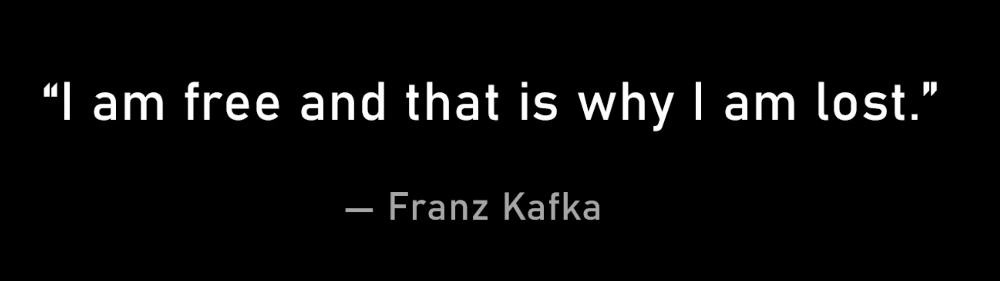

> 标题出自《10x Is Easier Than 2x》

说实话，第一次看《10x Is Easier Than 2x》这本书有种被救赎的感觉，那时我正处在职业倦怠期，刚好是裁员 在家蹲的状态，上一份工作给我带来了很多能量损耗，所以看到书里写的你应该以10倍目标的角度来看待生活，我第一次对自由职业有了不同看法。

曾经我以为的自由职业是上班的一个替代，意味着我自力更生不依靠公司来养活自己，当我用10x的思维来看待时，我开始认为自由职业是我应该做的事，因为它的回报上限很高，而上班是通往2x的路径，不值得追求。

于是我开始追求我认为的“自由”，自由职业不意味着悠闲，我不用一大早通勤，但是我甚至比上班的时候起的还早，因为觉得早上头脑更清醒（上班的时候怕打瞌睡所以不敢早起哈哈）。当我早起做了一大堆事情，看到时间才10点，平时这个时间我才刚到公司准备上班，这就让人很有满足感。但随着越来越久的“自由”，我发现自由都是有代价的。

代价之一：孤独

回想我日常都是和同事玩在一起，不上班之后确实会少了很多社交，在裁员没多久之后，我还经历了与交往快3年的前任分手，我本来也是个报喜不报忧的性格，很少跟朋友吐苦水，所以孤独感还是避免不了（感谢听到消息来找我聚的朋友们🧑‍🤝‍🧑）

代价之二：经济压力

虽然我目前的存款省点花还能让我撑个几年，还有失业金的加持，但失去了固定收入总让人有种莫名焦虑

代价之三：游离的目标

与上班不同，自由职业就像独自一人在沙漠寻找绿洲，往哪走都可能找到新世界，但没有目标你可能就会渴死，偶尔一天醒来时你会不认同昨天走过的路，但你知道今天你还要规划出一条新的路

这让我重新思考上班对我来说意味着什么

> 想要是内在动机，需要是外在动机

我的心路历程很好地诠释了“想要和需要之间的区别”

对我来说，上班的外在动机是：收入攀比、物欲、身份认同，因为追求`FIRE` 我一度觉得这些不值得也不应该当作目标，所以失业后我并没有马上开始找工作，外在动机在职业倦怠的时候失灵了

内在动机总是在深刻思考的时候才会发现，我回想过去工作的感受，突然发现“付出”对我工作积极性的影响被大大低估了，工作中感受到最有成就感和使命感的时候，往往是我完成了某项艰难任务或者规划的事情实现的时候，这就是内在动机

所以work harder成为了我的“想要”，而不是因为生计而坚持的“需要”

> 最高形式的自由是基于想要，而不是需要

